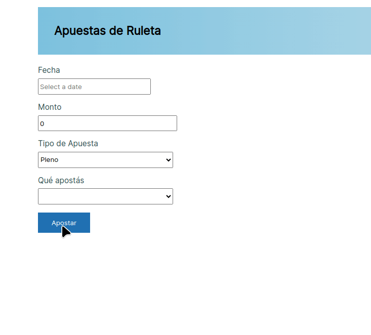

# Apuestas de una ruleta (TODO: ACTUALIZAR)

[](https://github.com/uqbar-project/eg-apuestas-angular/actions/workflows/build.yml) 


Esta aplicación permite mostrar cómo funciona el binding bidireccional.



# Creación de la aplicación

Creamos la aplicación con Angular CLI y agregamos las dependencias de Material Design for Bootstrap y MyDatePicker para contar con un control calendario (pueden ver [la documentación oficial aquí](https://github.com/kekeh/mydatepicker)).

# Arquitectura general


Se desarrolló la página principal en el componente raíz original app.component, que describiremos a continuación.

# Vista principal

La vista tiene tags propios del framework Material Design for Bootstrap. El binding es bidireccional para cargar todos los datos de una apuesta: fecha, monto, tipo de apuesta y valor apostado. Cuando el formulario tiene un error se visualiza dicho error con un cartel rojo (alert-danger), y cuando el usuario decide apostar se le informa si ganó o perdió con un cartel azul (alert-info).

## Ingreso de una fecha

Para cargar la fecha manualmente y además abrir un calendario en un formulario modal, utilizamos el control angular-mydatepicker, de la siguiente manera:

```html
<input class="form-control" name="fechaApuesta" data-testid="fechaApuesta" placeholder="Select a date"
  angular-mydatepicker #dp="angular-mydatepicker" [options]="opcionesFecha"
  (dateChanged)="dateSelected($event)" required />
<!-- clear date button -->
<div class="input-group-append">
  <button type="button" class="btn btn-secondary" *ngIf="apuesta.fecha" (click)="dp.clearDate()">
    <fa-icon [icon]="faCalendarTimes"></fa-icon>
  </button>
</div>

<!-- toggle calendar button -->
<div class="input-group-append">
  <button type="button" class="btn btn-primary" (click)="dp.toggleCalendar()">
    <fa-icon [icon]="faCalendar"></fa-icon>
  </button>
</div>
```

Esto requiere hacer imports en nuestro ngModule, que incluyen la biblioteca de íconos Font Awesome para poder utilizarlos:

```typescript
import { FontAwesomeModule } from '@fortawesome/angular-fontawesome'
import { AngularMyDatePickerModule } from 'angular-mydatepicker'

@NgModule({
  declarations: [
    AppComponent
  ],
  imports: [
    ...,
    AngularMyDatePickerModule,
    FontAwesomeModule
  ],
  ...
```

A su vez, el modelo de la vista (el _app.component.ts_) define

- imports para poder utilizar el ícono que levanta el calendario, y el que borra la fecha
- a su vez, el calendario se puede configurar con la referencia `opcionesFecha`, por ejemplo para decirle qué formato utilizar para mostrar las fechas o cuál es la mínima fecha que pueden ingresar

En el evento onInit configuramos estas dos propiedades. Para el caso de las opciones del calendario, se deshabilitan fechas hasta el día de ayer:

```typescript
export class AppComponent implements OnInit {
  ...
  opcionesFecha: IAngularMyDpOptions
  faCalendar = faCalendar
  faCalendarTimes = faCalendarTimes

  ngOnInit() {
    const ayer = new Date()
    ayer.setDate(ayer.getDate() - 1)
    this.opcionesFecha = {
      dateFormat: 'dd/mm/yyyy',
      disableUntil: this.dateToJson(ayer),
      dateRange: false,
    }
  }

  dateToJson(fecha: Date) {
    return {
      year: fecha.getFullYear(),
      month: fecha.getMonth() + 1,
      day: fecha.getDate()
    }
  }

  dateSelected(event: any): void {
    this.apuesta.fecha = event.singleDate.jsDate
  }
```

Tenemos dos métodos que adaptan el modelo del calendario al de la apuesta:

- el método `dateSelected` se dispara cuando el usuario selecciona una fecha en el calendario (véanlo en el HTML)
- el método `dateToJson` transforma un Date de javascript en la fecha JSON que utiliza el framework myDatePicker. Esto nos sirve para no permitir la selección de una fecha anterior a la de hoy.

# Combos anidados

El anidamiento de combos consiste en que el valor apostado depende del tipo de apuesta: para la apuesta pleno los valores a apostar posibles son de 1 a 36 mientras que si se apuesta a docena, deberías apostar primera, segunda o tercera docena.

En nuestro modelo, la apuesta tiene un _strategy_ TipoApuesta cuyas responsabilidades son:

- determinar los valores posibles a apostar
- validar si el tipo de apuesta es correcto

El modelo de la vista genera la lista de tipos de apuesta para poder llenar las opciones posibles del primer combo:

```typescript
export class AppComponent implements OnInit {
  tiposApuesta = [PLENO, DOCENA]
```

PLENO y DOCENA son dos _singletons_, podríamos haberlo definido al estilo _javero_, como variables públicas estáticas de la clase Apuesta:

```ts
export class Apuesta {
    public static PLENO : TipoApuesta = new Pleno()
    public static DOCENA : TipoApuesta = new Docena()
```

Pero en lugar de eso, preferimos definir los singletons como constantes exportables:

```ts
export const PLENO = new Pleno()
export const DOCENA = new Docena()
```

A su vez la apuesta inicializa la referencia tipoApuesta como pleno:
```typescript
export class Apuesta {
    tipoApuesta: TipoApuesta | undefined = PLENO
```

Veamos cómo se define el selector HTML en la vista:

```html
<h5 for="tipoApuesta" class="grey-text">Tipo de Apuesta</h5>
<select data-testid="tipoApuesta" name="tipoApuesta" class="form-control" [(ngModel)]="apuesta.tipoApuesta"
  required="true">
  <option *ngFor="let tipo of tiposApuesta" [ngValue]="tipo">{{tipo.descripcion}}</option>
</select>
```

Aquí vemos que las opciones salen de la colección tiposApuesta que define el modelo de la vista (_app.component.ts_), mientras que hay un binding bidireccional del select hacia apuesta.tipoApuesta. Entonces si la apuesta tiene un valor que no está dentro de las opciones, no será una selección válida para el combo, y no va a mostrar nada. Es decir, tanto la lista de tipos de apuesta como el valor tipoApuesta tienen que coincidir, no es válido hacer en apuesta:

```ts
  tipoApuesta = new Pleno()
```

Ni en el modelo de la vista

```ts
  tiposApuesta = [new Pleno(), new Docena()]
```

porque eso genera nuevas copias de Pleno y Docena que son distintas a las que tendría Apuesta.

Por otra parte, los valores a apostar son numéricos, lo que evita nuevas copias y por lo tanto, malos entendidos en el segundo combo. Vemos la configuración del selector en la vista:

```html
<select name="apuesta" data-testid="apuesta" class="form-control" [(ngModel)]="apuesta.valorApostado"
  [disabled]="!apuesta.tipoApuesta?.valoresAApostar" required="true">
  <option *ngFor="let valor of apuesta.tipoApuesta?.valoresAApostar" [ngValue]="valor">{{valor}}</option>
</select>
```

Es interesante que las opciones salen de "apuesta.tipoApuesta.valoresAApostar", por lo tanto, cuando modificamos la selección del tipo de apuesta en el primer combo, eso dispara una nueva lista de opciones para el segundo combo.

Un detalle adicional, se puede bindear el modelo de cada opción (ngValue) vs. el valor a mostrar (el html encerrado entre los tags _option_):

```html
<option *ngFor="let valor of apuesta.tipoApuesta.valoresAApostar" [ngValue]="valor">{{valor}}</option>
```

## Definición del tipo de apuesta

Podríamos haber definido el tipo de apuesta como un **union type**:

```ts
export type TipoApuesta = Pleno | Docena
```

Es decir, `TipoApuesta` sería de tipo `Pleno` o `Docena`. Pero tenemos dos temas:

- un nuevo tipo requiere agregar la información aquí
- tendremos un problema en el momento de trabajar con el valor a apostar, porque en la docena es un string mientras que para el caso del pleno es un número.

Entonces generamos un tipo que tiene la definición mínima, un poco más trabajosa:

```ts
export type TipoApuesta = {
  esGanador(numeroGanador: number, valorApostado: number | string): boolean
  validar(apuesta: Apuesta): void
  get ganancia(): number
  get valoresAApostar(): (number | string)[]
}
```

y utilizando duck typing no es necesario hacer nada en Pleno o Docena:

```ts
export class Pleno {
  ...
}
export class Docena {
  ...
}
```

# Evento apostar

## Validación - primera variante, con excepciones

Una primera alternativa es que el objeto de dominio apuesta tire excepciones por cada error de validación:

```typescript
validarApuesta() {
  const now = new Date()
  now.setHours(0, 0, 0, 0)
  if (!this.fecha) {
    throw 'Debe ingresar una fecha de apuesta'
  }
  if (now.getTime() > this.fecha.getTime()) {
    throw 'Debe ingresar una fecha actual o posterior al día de hoy'
  }
```

El modelo de la vista entonces intercepta los errores y los guarda en una variable _errorMessage_

```typescript
apostar() {
  try {
    this.errorMessage = ''
    this.apuesta.apostar()
  } catch (errorValidation: any) {
    this.errorMessage = errorValidation
  }
}
```

que a su vez la vista muestra con un cartel en rojo (si la referencia tiene algún valor)

```html
<div class="md-form" *ngIf="errorMessage">
    <div data-testid="errorMessage" class="alert alert-danger message">
      {{errorMessage}}
    </div>
  </div>
```

## Validación - segunda variante, colección de mensajes de validación

Una desventaja que tiene el approach anterior es que se lanza una excepción ante el primer error, de manera que el usuario al presionar el botón Apostar va recibiendo mensajes de a uno. Otra variante es agregar una colección de mensajes de validación en nuestro objeto de dominio Apuesta:

```ts
  validarApuesta() {
    this.errors.length = 0 // TODO: add a helper function clear()
    ...
    if (this.monto <= 0) {
      this.addError('monto', 'El monto a apostar debe ser positivo')
    }
    if (!this.tipoApuesta) {
      this.addError('tipoApuesta', 'Debe ingresar tipo de apuesta')
    } else {
      this.tipoApuesta.validar(this)
    }
```

Los errores independientes se van sumando a la lista de mensajes de validación (ahora necesitamos un tratamiento especial para asumir que el tipo de apuesta no puede ser nula para delegar la validación). `addError` es simplemente un método helper para crear un nuevo ValidationMessage:

```ts
export class ValidationMessage {
  constructor(public field: string, public message: string) {}
}

export class Apuesta {
  ...
  addError(field: string, message: string) {
    this.errors.push(new ValidationMessage(field, message))
  }
``` 

En el html principal delegamos a otro componente que muestra los mensajes de error de un field (le pasa la apuesta y el nombre del campo):

```html
  <div class="md-form">
    <h5 for="monto" class="grey-text">Monto</h5>
    <input type="number" data-testid="monto" name="monto" ...>
    <validation-field [apuesta]="apuesta" [field]="'monto'"></validation-field>
  </div>
```

El componente ValidationField es sencillo, el html muestra un div el error del campo si existe (pueden ver los métodos en apuesta para determinar si hay errores para un campo o bien cuáles son esos errores de validación):

```html
<div class="md-form" *ngIf="apuesta.hasErrors(field)">
  <div data-testid="errorMessage" class="validation alert alert-danger message">
    {{apuesta.errorsFrom(field)}}
  </div>
</div>
```

Recibimos como @Input la apuesta y el nombre del campo:

```ts
export class ValidationFieldComponent {
  @Input() apuesta!: Apuesta
  @Input() field!: string
}
``` 

A futuro podríamos extraer un componente más general, encontrando una abstracción que también sea más general: un objeto de nuestro dominio podría tener la colección de errores, métodos para agregar un error de validación, determinar si hay un error para ese campo, etc.

## Resultado de la apuesta

Una vez pasadas las validaciones, se genera un objeto Resultado dentro del objeto apuesta, que se visualiza en la vista, de igual manera que con el mensaje de error:

```html
  <div class="alert alert-info" data-testid="resultado" *ngIf="apuesta.resultado">
    {{apuesta.resultado.valor()}}
  </div>
```

# Testing

## Testeo unitario

Para destacar, tenemos tests unitarios sobre la apuesta, para chequear que el proceso de validación de la apuesta está correctamente desarrollado. Esos tests pueden verse en el archivo _apuesta.spec.ts_, donde planteamos:

- escenario feliz: se puede apostar cuando la apuesta está completa
- escenarios con error
  - que falte la fecha de apuesta,
  - ingresar un monto inválido (negativo),
  - no ingresar el tipo de apuesta (pleno o docena)
  - no ingresar valor apostado (número o docena),
  - poco monto para el tipo de apuesta ingresado

## Testeo del componente

Además tenemos el testeo del componente principal, que delega al objeto de dominio Apuesta pero que también incluye la respuesta html. Por ejemplo, podemos probar que si el objeto Apuesta está bien construido, se visualiza el resultado en un class "alert-info". Como en los ejemplos anteriores, identificamos los elementos del formulario mediante el atributo `data-testid`:

```ts
  beforeEach(async(() => {
    TestBed.configureTestingModule({
      declarations: [ AppComponent ],
      imports: [ ... ],
    }).compileComponents()
    fixture = TestBed.createComponent(AppComponent)
    app = fixture.debugElement.componentInstance
  }))
  it('should pass all validations and inform user win/loose result', async(() => {
    app.apuesta = Object.assign(
      new Apuesta(),
      {
        fecha: new Date(),
        monto: 60,
        tipoApuesta: PLENO,
        valorApostado: 25,
      }
    )
    getByTestId(fixture, 'btnApuesta').click()
    fixture.detectChanges()
    expect(resultado(fixture)).toBeTruthy()
  }))
```

Al no cargar alguno de los valores estamos testeando que se visualice el mensaje de error. El lector puede pensar que hay cierta duplicidad respecto al anterior test unitario de la apuesta, pero este test es más global: no estamos esperando una excepción de apuesta, sino un mensaje dentro de un div, lo que implica que estamos validando que el componente principal de la aplicación captura el error adecuadamente.

```ts
  it('should fail if negative amount is entered', async(() => {
    app.apuesta = Object.assign(
      new Apuesta(),
      {
        fecha: new Date(),
        monto: -10,
      }
    )
    getByTestId(fixture, 'btnApuesta').click()
    fixture.detectChanges()
    expect(mensajeDeError(fixture, 'monto')).toContain('El monto a apostar debe ser positivo')
  }))
```

Recordemos que el archivo de tests del componente debe replicar los imports del ngModule.

Y por último, mostramos cómo podemos asegurar que una apuesta puede ser ganadora (lo mismo para ser perdedora):

```ts
it('should pass all validations and inform if user wins - single', () => {
  app.apuesta = apostarAl(PLENO, 25)
  app.apuesta.obtenerNumeroGanador = () => 25
  getByTestId(fixture, 'btnApuesta').click()
  fixture.detectChanges()

  expect(resultado(fixture)).toContain('Ganaste $700')
})
```

Dada la naturaleza dinámica de typescript, podemos redefinir el comportamiento del método obtenerNumeroGanador para que devuelva siempre 25 dentro del contexto del test.

## Material adicional

- [Repositorio NPM de Font awesome](https://www.npmjs.com/package/@fortawesome/angular-fontawesome)
- [Buscador de íconos de Font Awesome](https://fontawesome.com/icons?d=gallery&q=delete)
