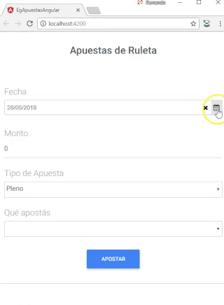

# Apuestas de una ruleta

[](https://travis-ci.org/uqbar-project/eg-apuestas-angular)

Esta aplicación permite mostrar cómo funciona el binding bidireccional.



# Creación de la aplicación

Creamos la aplicación con Angular CLI y agregamos las dependencias de Material Design for Bootstrap y MyDatePicker para contar con un control calendario (pueden ver [la documentación oficial aquí](https://github.com/kekeh/mydatepicker/blob/master/README.md)):

```bash
$ ng new eg-apuestas-angular
$ cd eg-apuestas-angular
$ npm install mdbootstrap --save
$ npm install mydatepicker --save
```

# Arquitectura general


Se desarrolló la página principal en el componente raíz original app.component, que describiremos a continuación.

# Vista principal

La vista tiene tags propios del framework Material Design for Bootstrap. El binding es bidireccional para cargar todos los datos de una apuesta: fecha, monto, tipo de apuesta y valor apostado. Cuando el formulario tiene un error se visualiza dicho error con un cartel rojo (alert-danger), y cuando el usuario decide apostar se le informa si ganó o perdió con un cartel azul (alert-info).

## Ingreso de una fecha

Para cargar la fecha manualmente y además abrir un calendario en un formulario modal, utilizamos el control myDatePicker, de la siguiente manera:

```html
    <my-date-picker name="fechaApuesta" [options]="opcionesFecha"
                    [(ngModel)]="fechaModel" required></my-date-picker>
``` 

Esto requiere hacer imports en nuestro ngModule:

```typescript
import { MyDatePickerModule, MyDatePicker } from 'mydatepicker'
...

@NgModule({
  declarations: [
    AppComponent
  ],
  imports: [
    ...,
    MyDatePickerModule
  ],
```

A su vez, el modelo de la vista (el _app.component.ts_) define 

- una variable fechaModel que hace de modelo intermedio, para poder adaptar la fecha JSON del date picker (que tiene como propiedades year, month y day) a un Date de javascript
- a su vez, el calendario se puede configurar a través de un JSON, por ejemplo para decirle qué formato utilizar para mostrar las fechas o cuál es la mínima fecha que pueden ingresar

En el evento onInit configuramos estas dos propiedades. Para el caso de las opciones del calendario, se deshabilitan fechas hasta el día de ayer: 

```typescript
export class AppComponent implements OnInit {
  opcionesFecha: {}
  fechaModel : any = {}
  ...

  ngOnInit() {
    const ayer = new Date()
    ayer.setDate(ayer.getDate() - 1)
    this.opcionesFecha = {
      dateFormat: 'dd/mm/yyyy', disableUntil: this.convertirANuevoDate(ayer)
    }
    const fechaApuesta = this.apuesta.fecha
    this.fechaModel = {
      date: this.convertirANuevoDate(fechaApuesta)
    }
  }

  convertirANuevoDate(fecha: Date) {
    return {
      year: fecha.getFullYear(),
      month: fecha.getMonth() + 1,
      day: fecha.getDate()
    }
  }  
```

El método convertirANuevoDate transforma un Date de javascript en la fecha JSON que utiliza el framework myDatePicker.

# Combos anidados

El anidamiento de combos consiste en que el valor apostado depende del tipo de apuesta: para la apuesta pleno los valores a apostar posibles son de 1 a 36 mientras que si se apuesta a docena, deberías apostar primera, segunda o tercera docena.

En nuestro modelo, la apuesta tiene un _strategy_ TipoApuesta cuyas responsabilidades son:

- determinar los valores posibles a apostar
- validar si el tipo de apuesta es correcto

El modelo de la vista genera la lista de tipos de apuesta para poder llenar las opciones posibles del primer combo:

```typescript
export class AppComponent implements OnInit {
  tiposApuesta = [Apuesta.PLENO, Apuesta.DOCENA]
```

Apuesta.PLENO y Apuesta.DOCENA son dos _singletons_, ¿por qué hacemos esto? Porque a su vez la apuesta inicializa la referencia tipoApuesta como pleno:

```typescript
export class Apuesta {
    public static PLENO : TipoApuesta = new Pleno()
    public static DOCENA : TipoApuesta = new Docena()

    fecha = new Date()
    monto = 0
    tipoApuesta : TipoApuesta = Apuesta.PLENO
```

Veamos cómo se define el selector HTML en la vista:

```html
<div class="md-form">
<h5 for="tipoApuesta" class="grey-text">Tipo de Apuesta</h5>
<select id="tipoApuesta" name="tipoApuesta" class="form-control" [(ngModel)]="apuesta.tipoApuesta" required="true">
    <option *ngFor="let tipo of tiposApuesta" [ngValue]="tipo">{{tipo.descripcion}}</option>
</select>
</div>
```

Aquí vemos quie las opciones salen de la colección tiposApuesta que define el modelo de la vista (_app.component.ts_), mientras que hay un binding bidireccional del select hacia apuesta.tipoApuesta. Entonces si la apuesta tiene un valor que no está dentro de las opciones, no será una selección válida para el combo, y no va a mostrar nada. Es decir, tanto la lista de tipos de apuesta como el valor tipoApuesta tienen que coincidir, no es válido hacer en apuesta:

```typescript
    tipoApuesta : TipoApuesta = new Pleno()
```

Ni en el modelo de la vista

```typescript
  tiposApuesta = [new Pleno(), new Docena()]
```

porque eso genera nuevas copias de Pleno y Docena que son distintas a las que tendría Apuesta.

Por otra parte, los valores a apostar son numéricos, esto evita nuevas copias y por lo tanto, malos entendidos en el segundo combo. Vemos la configuración del selector en la vista:

```html
<div class="md-form">
<h5 for="apuesta" class="grey-text">Qu&eacute; apost&aacute;s</h5>
<select name="apuesta" id="apuesta" class="form-control" [(ngModel)]="apuesta.valorApostado" [disabled]="!apuesta.tipoApuesta.valoresAApostar"
    required="true">
    <option *ngFor="let valor of apuesta.tipoApuesta.valoresAApostar" [ngValue]="valor">{{valor}}</option>
</select>
</div>
```

Es interesante que las opciones salen de "apuesta.tipoApuesta.valoresAApostar", por lo tanto, cuando modificamos la selección del tipo de apuesta en el primer combo, eso dispara una nueva lista de opciones para el segundo combo.

Un detalle adicional, se puede bindear el modelo de cada opción (ngValue) vs. el valor a mostrar (el html encerrado entre los tags _option_):

```html
<option *ngFor="let valor of apuesta.tipoApuesta.valoresAApostar" [ngValue]="valor">{{valor}}</option>
```

# Evento apostar 

## Manejo de errores

Dado que al apostar los objetos de dominio apuesta pueden tirar errores de validación:

```typescript
validarApuesta() {
    const now = new Date()
    now.setHours(0, 0, 0, 0)
    if (!this.fecha) {
        throw "Debe ingresar una fecha de apuesta"
    }
    if (now.getTime() > this.fecha.getTime()) {
        throw "Debe ingresar una fecha actual o posterior al día de hoy"
    }
```

lo que hace el modelo de la vista es interceptar los errores y guardarlos en una variable _errorMessage_ 

```typescript
  apostar() {
    try {
      this.apuesta.fecha = this.convertirADate(this.fechaModel)
      this.errorMessage = ""
      this.apuesta.apostar()
    } catch (errorValidation) {
      this.errorMessage = errorValidation
    }
  }
```

que a su vez la vista muestra con un cartel en rojo (si la referencia tiene algún valor)

```html
<div class="alert alert-danger" *ngIf="errorMessage">
    {{errorMessage}}
</div>
```

## Resultado de la apuesta

Una vez pasadas las validaciones, se genera un objeto Resultado dentro del objeto apuesta, que se visualiza en la vista, de igual manera que con el mensaje de error:

```html
<div class="alert alert-info" *ngIf="apuesta.resultado">
    {{apuesta.resultado.valor()}}
</div>
```

# Testing

## Testeo unitario

Para destacar, tenemos tests unitarios sobre la apuesta, para chequear que el proceso de validación de la apuesta está correctamente desarrollado. Esos tests pueden verse en el archivo _apuesta.spec.ts_:

```typescript
import { async } from '@angular/core/testing'
import { Apuesta } from './apuesta'

let apuestaOk : Apuesta

describe('Apuesta', () => {
    beforeEach(async(() => {
        apuestaOk = new Apuesta()
        apuestaOk.monto = 60
        apuestaOk.tipoApuesta = Apuesta.PLENO
        apuestaOk.valorApostado = 3
    }))
    it('apuesta valida pasa validaciones ok', async(() => {
        apuestaOk.validarApuesta()
    }))
    it('apuesta sin fecha tira error', async(() => {
        const apuestaSinFecha = new Apuesta()
        apuestaSinFecha.fecha = null
        expect(() => apuestaSinFecha.validarApuesta()).toThrow("Debe ingresar una fecha de apuesta")
    }))
    ...
```

## Testeo del componente

Además tenemos el testeo del componente principal, que delega al objeto de dominio Apuesta pero que también incluye la respuesta html. Por ejemplo, podemos probar que si el objeto Apuesta está bien construido, se visualiza el resultado en un class "alert-info":

```typescript
  it('should pass all validations and inform user win/loose result', async(() => {
    fixture.detectChanges()
    let compiled = fixture.debugElement.nativeElement
    const apuestaValida = new Apuesta()
    apuestaValida.monto = 60
    apuestaValida.tipoApuesta = Apuesta.PLENO
    apuestaValida.valorApostado = 25
    app.apuesta = apuestaValida
    compiled.querySelector("#btnApuesta").click()
    fixture.detectChanges()
    compiled = fixture.debugElement.nativeElement
    expect(compiled.querySelector('.alert-info').textContent).toBeTruthy()
  }))
```

Como la apuesta tiene un componente de azar, no podemos saber si el usuario ganará o perderá, pero sí podemos verificar que el resultado tenga algo (_truthy_ incluye distinto de null y distinto de undefined).

Otros tests posibles serían verificar que al no cargar alguno de los valores se visualice el mensaje de error en un elemento que tenga class "alert-danger". El lector puede pensar que hay cierta duplicidad respecto al anterior test unitario de la apuesta, pero este test es más global: no estamos esperando una excepción de apuesta, sino un mensaje dentro de un div, lo que implica que estamos validando que el componente principal de la aplicación captura el error adecuadamente.

```typescript
  it('should fail if no date is entered', async(() => {
    fixture.detectChanges()
    let compiled = fixture.debugElement.nativeElement
    app.fechaModel = null
    compiled.querySelector("#btnApuesta").click()
    fixture.detectChanges()
    compiled = fixture.debugElement.nativeElement
    expect(compiled.querySelector('.alert-danger').textContent).toContain('Debe ingresar una fecha de apuesta')
  }))
  it('should fail if negative amount is entered', async(() => {
    fixture.detectChanges()
    let compiled = fixture.debugElement.nativeElement
    app.apuesta.monto = -10
    compiled.querySelector("#btnApuesta").click()
    fixture.detectChanges()
    compiled = fixture.debugElement.nativeElement
    expect(compiled.querySelector('.alert-danger').textContent).toContain('El monto a apostar debe ser positivo')
  }))
```

Recordemos que el archivo de tests del componente debe replicar los imports del ngModule:

```typescript
import { TestBed, async, ComponentFixture } from '@angular/core/testing'
import { AppComponent } from './app.component'
import { BrowserModule } from '@angular/platform-browser'
import { FormsModule } from '@angular/forms'
import { MyDatePickerModule, MyDatePicker } from 'mydatepicker'
import { Apuesta } from './apuesta'
```