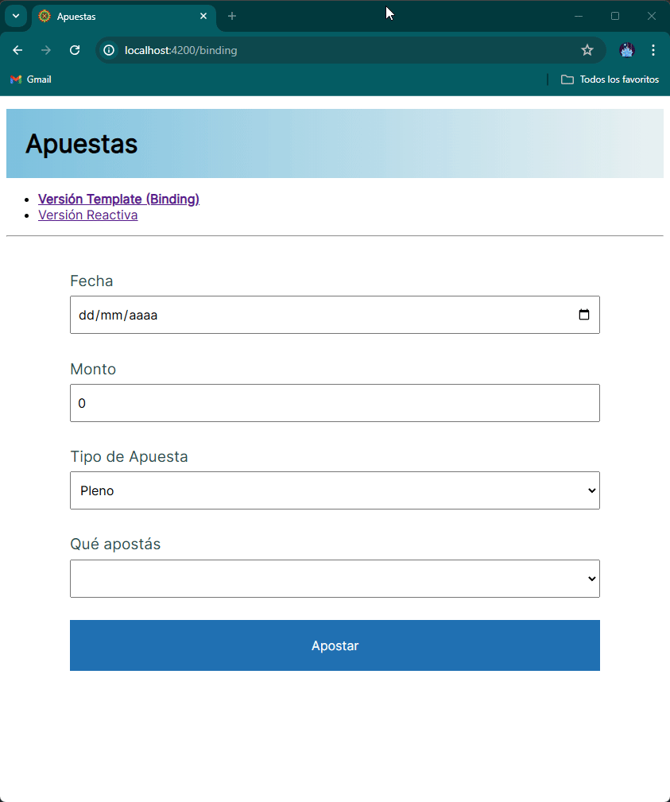

> ## Antes de presentar la variante reactiva...
>
> La idea de tener un binding automático no es nueva de Angular, pero sí fue notablemente masivo desde su llegada al mercado con AngularJS (las versiones de Angular 1). No obstante, una sombra larga se posó sobre el framework: era "lento", o en todo caso, en algunos casos de uso donde había dependencia entre muchos controles, la aplicación degradaba su performance y peor aun, se tornaba impredecible (así surgió React desde las oficinas de Facebook).
>
> Esa marca trató de borrarse a partir del relanzamiento de Angular (a secas, sin JS) cuando el framework abrazó Typescript de entrada y además decidió hacer un lanzamiento de una versión major cada 6 meses. Hay que decir que pese a esos esfuerzos por mejorar la imagen, quedó flotando en el ambiente la idea de que Angular no funcionaba tan rápido como React.
>
> La biblioteca que se encarga de manejar el binding entre modelo y vista es "zone.js". Lamentablemente, zoneJS tiene una estrategia poco feliz para manejar los cambios:
>
> - cualquier cambio en un componente dentro de una página, dispara una actualización de toda la jerarquía de componentes (no importa si se modificaron o no). Esto implica que si tenemos una gran cantidad de componentes, Angular puede estar reescribiendo el DOM de nuestra página web muchas veces de manera innecesaria.
> - cada componente puede modificar esta estrategia mediante la configuración `changeDetection: ChangeDetectionStrategy.OnPush` y así lo que sucede es que cuando ocurre un cambio en un componente, Angular rastrea a partir de la raíz de la jerarquía buscando cambios en nuestro template para detectar si por ejemplo se debería mostrar información nueva al usuario. 
>
> Lo raro es que no solamente el comportamiento por defecto es el que utiliza menos recursos, sino que el equipo de trabajo de Angular está trabajando para que el componente ZoneJS sea opcional, reemplazándolo por 1. signals, 2. change detector ref, que nos permite hacer llamadas específicas donde indicamos al framework que debe volver a renderizar la información del componente. 
>
> Esta decisión tiene algunas desventajas
>
> - no todas las páginas tienen mala performance
> - ok, podemos elegir si queremos usar ZoneJS o no, pero eso implica que soportemos heterogeneidad de nuestros componentes o bien que necesitemos más líneas para lograr la misma funcionalidad que antes teníamos gratis.
>
>
> Recomendamos
>
> - [esta introducción](https://www.youtube.com/watch?v=EWtma0v-WzQ) de Carlos Morales
> - y [este video](https://www.youtube.com/watch?v=lmrf_gPIOZU) de Joshua Morony que explica con más profundidad el comportamiento por debajo de Zone JS.

## Ahora sí, formularios reactivos



Angular 2 nació también con la idea de tener una alternativa a los formularios con templating (o binding) que son los **reactive forms**.

Los elementos principales de un formulario reactivo son:

- **form control**: se asocia a un control de UI (input, checkbox, dropdown), por lo tanto guardan los valores que ingresa el usuario, hacen el seguimiento de los cambios y podemos registrarle validaciones como veremos más adelante.
- **form group**: podemos agrupar varios controles para que la carga y la validación se haga en conjunto, como una dirección, la carga de datos personales, etc.

## Formulario de apuesta

Para crear un formulario utilizamos un **form builder** que permite mejorar la expresividad

```ts
apuestaForm = this.formBuilder.group({
  fecha: ['', [Validators.required, DateValidator.equalOrGreaterThanToday]],
  monto: ['', [Validators.required, Validators.min(MONTO_MINIMO_PLENO + 1)]],
  valorApostado: [1, [Validators.required]],
  resultado: ['']
})
```

El form builder se inyecta en el constructor (_constructor injection_)

```ts
constructor(private formBuilder: FormBuilder) {}
```

y el formulario agrupa los controles que se definen pasando:

- una clave que define el nombre del campo,
- y como valor
  - un valor inicial que marca también el tipo que almacenan (string para fecha, number para monto, etc.)
  - una lista de validadores que determinan si el campo es válido y adicionalmente permiten mostrar un mensaje _custom_

Cada control necesita indicar el nombre del formControl

```html
<div class="row">
  <input type="date" data-testid="fechaApuesta" id="fecha" name="fecha" formControlName="fecha" placeholder="Fecha de apuesta">
</div>
```

## Validaciones

En este caso componentizamos la muestra de los errores de validación.

Dicho componente, al que le pasamos como referencia el FormControl relevante, puede acceder programaticamente a ciertos detalles:
* Primero, solo renderiza cuando hay errores, y el campo ha sido "tocado".
* Luego, de ser así recorre el listado de errores y los muestra individualmente con su respectivo mensaje.

```html
@if (tieneErrores()) {
  <div class="validation-row" [attr.data-testid]="'errors-' + fieldName">
    @for (validator of getListaErrores(); track validator) {
    <div [attr.data-testid]="'errorMessage-' + validator" class="validation">
      {{getMensajeError(validator)}}
    </div>
    }
  </div>
}
```

La implementación de errorMessage es una función que tiene baja cohesión, conoce todas las validaciones del formulario, y a medida que crece la cantidad de campos se vuelve más y más extenso:

```ts
getMensajeError(validator: string) {
  const errors = this.control.errors! // Solo debería llegar acá si esto existe

  if (validator === 'required') return `Debe ingresar ${this.fieldName}`
  if (validator === 'min') return `Debe ingresar un valor mayor para ${this.fieldName}`
  return errors[validator].message ?? `Hay un error con el campo ${this.fieldName}: ${validator}`
}
```

> **Nota menor:** `??` es la versión typescript del "elvis operator" en kotlin: devuelve el valor de la izquierda cuando no es `null` o `undefined`, y el de la derecha en caso contrario.

### Validadores Propios

Para determinar si la fecha de apuesta es válida, definimos un validador propio. En su nivel mínimo, este debe ser una función que cumpla con tres requisitos:
* Debe recibir como parametro un objeto de tipo `AbstractControl`.
* Si el campo es válido, la función debe retornar null
* Si no lo es, tiene que retornar algo.
  - Usualmente se devuelve un objeto, con una clave arbitraria seteada a algun booleano.
  - Podemos aprovechar esto para incluir un mensaje de error a mostrar en nuestro template.

Para no tener múltiples funciones esparcidas en nuestros componentes, podemos agruparlas en una clase:

```ts
export class DateValidator {
  static equalOrGreaterThanToday(control: AbstractControl) {
    const value = control.value
    if (value === null || value === '') return null

    const pickedDate = dayjs(value).toDate()
    const now = new Date()
    pickedDate.setHours(0,0,0,0)
    now.setHours(0,0,0,0)

    if (pickedDate < now)
      return { dateShouldBeEqualOrGreaterThanToday: { message: 'Debe ingresar fecha de hoy o futura' } }

    return null
  }
}
```

Tal vez observen algo ligeramente extraño al comienzo. Si viene sin valor, ¿devolvemos `null` como si todo estuviera bien?
* Sí, eso ya lo podemos controlar con `Validators.required`. Validarlo de nuevo sería una responsabilidad duplicada
* De tener el campo como opcional, no queremos que se queje cuando no se haya ingresado
  - Queda a cargo del "submit" considerar el caso sin valor, y manejarlo apropiadamente
  - Si no es un valor vacío, va a tener garantizado que fue validado


La interfaz que define el validador de Angular es un poco rara: es un objeto con una clave para el validador y adicionalmente un mensaje específico (o un booleano que indica si el valor es correcto).

## Apostar

A la hora de definir el comportamiento del botón Apostar, aparecen algunas cuestiones

- al no haber binding, necesitamos pasar la información que está en el form control hacia el objeto apuesta, lo que puede necesitar ciertas transformaciones (como en el caso de la fecha)
- siendo así, solo queremos proceder cuando nuestras validaciones funcionaron. Aquí podemos aprovechar, como mencionamos un poco más arriba, para "tocar" todos los campos, y que se muestren todos los errores pendientes
- luego de ejecutada la apuesta, se genera un objeto Resultado, pero nuevamente no hay binding, con lo cual tenemos que **manualmente** asignar un form control que sirve para tal fin para que el usuario lo visualice
- en nuestro caso, al tener la misma clase Apuesta del ejemplo con templates tenemos una doble validación: la propia del formulario, y la interna que realiza el objeto
  - Es posible que estas validaciones no coincidan, o que el objeto igual tenga errores propios independientes del formulario. Siendo así, podemos capturar preventivamente esos errores y manejarlos/mostrarlos (en este ejemplo, para simplificar salen por consola)

## Consecuencias

- Para evitar que el ejemplo se extienda mucho, no implementamos la combinación de dropdowns para el tipo de apuesta vs. el valor a apostar. Solo permitimos apostar a pleno
- Aun así, pasamos de 27 líneas a 77 aun con menos funcionalidades. La versión reactiva tiene menos declaratividad, y ese control trae como costo la necesidad de ser explícito con lo que queremos hacer
- Hay algunas posibles ventajas en casos de formularios más complejos, o dinámicos. Principalmente, al no estar unido por binding a un objeto de un dominio podemos 
- El testing no tiene diferencias con la otra variante, trabajamos con `data-testid`

## Links

- [Volver al README](../README.md)
- [Ver la explicación del formulario con templating](./templating.md)
